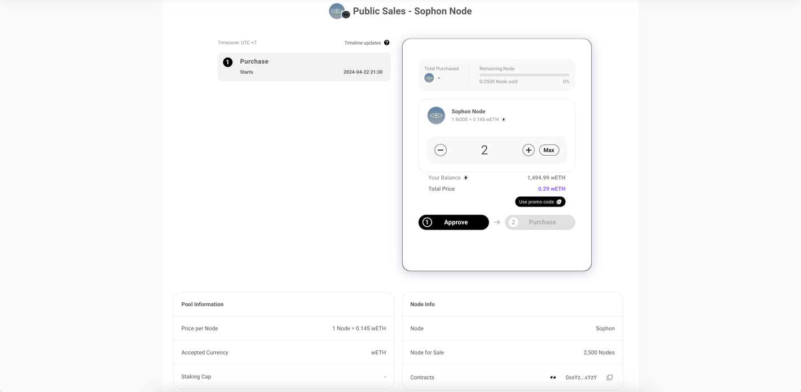

# Sale instructions

## How to participate Whitelist Node Sale on Impossible Finance

This tutorial concerns everyone who has been granted a whitelist spots.

### **Step 1 - Connect wallet on Node Sale Page** 

Head over to the official website of the Node Sale. Please double-check you are using the only official domain out there, listed underneath.

* [nodes.sophon.xyz](https://nodes.sophon.xyz)

<figure><figcaption></figcaption></figure>

### Step 2 - **Get purchase tokens for the relevant network** 

The Sophon Node sale is happening on ZkSync, and the supported purchase token is WETH. Therefore, you will need to have WETH on the ZkSync network in order to participate in the sale. To do so, you can follow the guide below:


[zksync-bridging-instructions.md](zksync-bridging-instructions.md)


### Step 3 - **Select available tier and click “Purchase”** 

_Note: All images used are for illustrative purposes only. The actual sale page may differ from the images displayed._

On the Node Sale page (powered by Impossible Finance), choose the tier available to you and click on "Purchase".

**Important:** If your wallet has been whitelisted, you will **only be able to see the tier you are whitelisted for.**

To illustrate, the image below shows a user who has been whitelisted for Tiers 1, 7 and 8 only.

<figure><figcaption></figcaption></figure>

### Step 4 - **Input promo code if you have one** 

If you have a promo code to use, click on “Use promo code” and enter your code.

> _Note that sale discounts from using a promo code will not be automatically applied during purchase. Cash rebates will be airdropped to your purchase wallets upon confirmation your referrer has also purchased a node._

<figure><figcaption></figcaption></figure>

### **Step 5 - Purchase your Node** 

Click on “Approve” on the sale page. You will be prompted to sign a contract in your wallet. Once it has been signed, select “Purchase” and click “Agree” to the [node sale terms and conditions](https://sophon.xyz/node-sale-terms).

<figure><figcaption>
Approve the spending of your wETH on zkSync
</figcaption></figure>

<figure><figcaption>
After approval, press 'Purchase'
</figcaption></figure>

<figure><figcaption>
Confirm the purchase in your wallet
</figcaption></figure>

<figure><figcaption>
After your transaction is confirmed, your purchase is completed.
</figcaption></figure>
