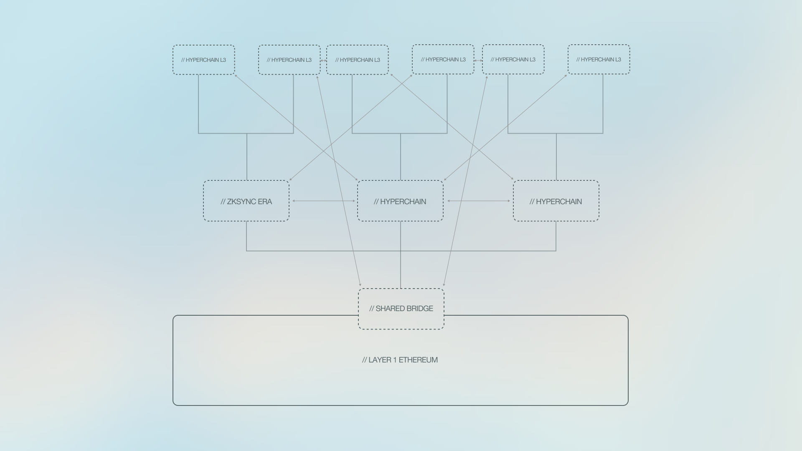

# What is ZK Stack?

<figure><figcaption></figcaption></figure>

ZK Stack is a modular framework for building sovereign ZK-powered Ethereum rollups (called Hyperchains); it is a modular, open-source framework that is both free and designed to build custom Hyperchains, Sophon in our case, (ZK-powered L2s and L3s), based on the code of zkSync Era, the first Hyperchain.

At its core, the ZK Stack offers two key features: sovereignty and seamless connectivity.  The creator (Sophon in our case) possesses full rights to the code and enjoys unrestricted autonomy to customize and shape many aspects of the chain.&#x20;
